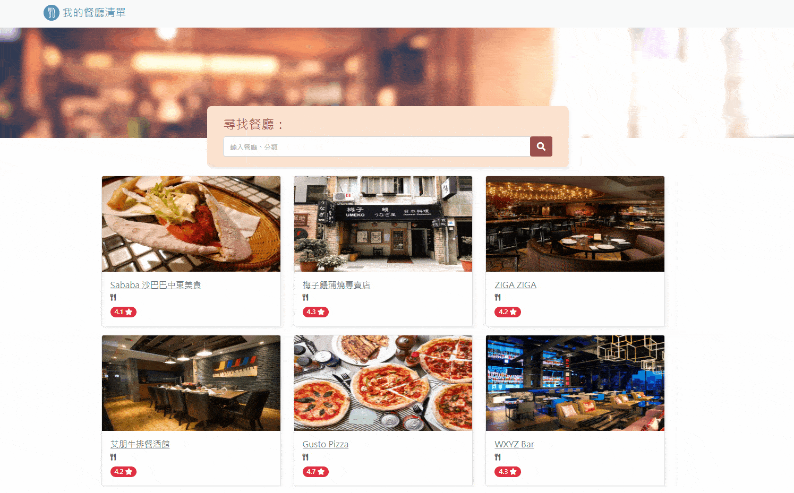

<a name="readme-top"></a>

<!-- PROJECT LOGO -->
<div align="center">
  <a href="https://github.com/CYW-Allen/restaurant-list">
    
  </a>

  <h1 align="center">Restaurant list</h1>
  <h3 align="center">An express app for manipulating the resutaurant list</h3>
</div>


<!-- TABLE OF CONTENTS -->
<details>
  <summary>Table of Contents</summary>
  <ol>
    <li>
      <a href="#about-the-project">About The Project</a>
      <ul>
        <li><a href="#main-function">Main Function</a></li>
        <li><a href="#additional-modifications">Additional Modifications</a></li>
        <li><a href="#built-with">Built With</a></li>
      </ul>
    </li>
    <li>
      <a href="#getting-started">Getting Started</a>
    </li>
    <li><a href="#extra-resources">Extra resources</a></li>
  </ol>
</details>


<!-- ABOUT THE PROJECT -->
## About The Project

<div align="center">
  
</div>

### Main Function
* Create new restaurant infos.
* Edit the restaurant infos in the list.
* List all restaurants' infos stored in mysql db.
* Filter the restaurants with some specific keyword.
* Delete unwanted restaurant infos.

### Additional modifications
* Make the scrollable area located on the list block.
* Auto clear the input field when user focus on, and make the previous query string displayed on the above text field.
* Add prompt when the query result is empty.
* Lazyload restaurant image.

### Built With

* [![Express][Express.js]][Express-url]
* [![Bootstrap][Bootstrap.com]][Bootstrap-url]

<p align="right">(<a href="#readme-top">back to top</a>)</p>


<!-- GETTING STARTED -->
## Getting Started

### Installation

1. Clone the repo
   ```sh
   git clone https://github.com/CYW-Allen/restaurant-list.git
   ```
2. Install NPM packages
   ```sh
   npm install
   ```
3. Initiate mysql service 
4. Initialize the database (optional) 
   ```sh
   npm run initdb
   ```
5. Insert some seed data (optional)
   ```sh
   npm run seed
   ```

After above steps, now you can run the app by the following command.
  ```sh
  npm start
  ```

<p align="right">(<a href="#readme-top">back to top</a>)</p>


<!-- Resources -->
## Extra resources

* <a href="https://www.flaticon.com/free-icons/restaurant" title="restaurant icons">Restaurant icons created by Freepik - Flaticon</a>
* <a href="https://github.com/othneildrew/Best-README-Template/blob/master/BLANK_README.md" title="readme template">Readme template</a>

<p align="right">(<a href="#readme-top">back to top</a>)</p>


<!-- MARKDOWN LINKS & IMAGES -->
<!-- https://www.markdownguide.org/basic-syntax/#reference-style-links -->
[Express.js]: https://img.shields.io/badge/Express.js-rgb(194%2C%20234%2C%20255)?style=for-the-badge&logo=nodedotjs&logoColor=green
[Express-url]: https://expressjs.com/
[Bootstrap.com]: https://img.shields.io/badge/Bootstrap-563D7C?style=for-the-badge&logo=bootstrap&logoColor=white
[Bootstrap-url]: https://getbootstrap.com
